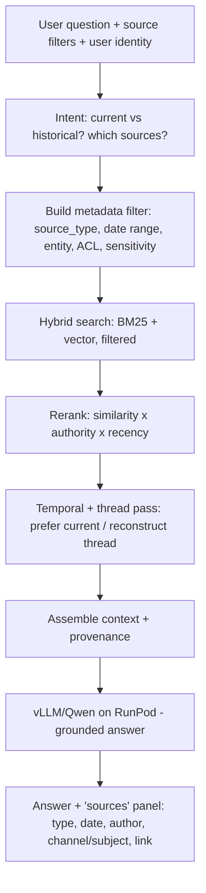

# YAP Enterprise Knowledge Architecture — Teams, Email & Operational Communications

> Design + recommendation doc for turning YAP into a source-aware, temporally-aware IT operations
> knowledge base. **No code changed** — this is the architecture and a phased MVP verdict.
> Companion to `IT-Documentation-Insights.md`. Date: 2026-06-01.

---

## 0. TL;DR — the verdict you asked for

**Yes**, a combination of *RAG + metadata filtering + hybrid search + structured knowledge +
temporal reasoning* is substantially better than "text → embeddings" for IT ops — but **a full
knowledge graph is not worth it for the MVP**. The single biggest value driver isn't the fancy
retrieval; it's a **rich, uniform provenance + temporal metadata schema** underneath everything.
Get that right and the rest is reranking on top of it.

| Component | Verdict | Phase |
|-----------|---------|-------|
| Uniform provenance metadata schema | **Foundational — do first** | **MVP** |
| Vector RAG (you already have this) | Keep | **MVP** |
| **Hybrid search** (BM25 + vector) | **Do it — critical for IT** | **MVP** |
| Metadata pre-filtering (source/date/entity) | **Do it** | **MVP** |
| Temporal metadata + current/historical intent | **Do it — core value** | **MVP** |
| Secret detection / redaction before indexing | **Mandatory before any comms** | **MVP** |
| Provenance display ("where did this come from") | **Do it** | **MVP** |
| Source-type UI filter | **Do it (simple version)** | **MVP** |
| Configurable source authority weights | Simple weights now, supersession later | MVP-lite → P2 |
| Email thread reconstruction | Do it (headers make it easy) | **MVP / P2** |
| Teams thread reconstruction | Data is hard to get — see §2 | P2 |
| Structured knowledge extraction (dual repr.) | Auto + human review | **P2** |
| Attachment parsing + linking | Do it | **P2** |
| Entities-as-metadata (device/VLAN/IP/ticket) | Start extracting into metadata | **P2** |
| Full knowledge graph DB (Neo4j etc.) | **Postpone / maybe never** | P3 |
| Multi-user ACL / permission preservation | Single-user first | P3 |
| Reactions, sentiment, etc. | Nice-to-have | P3 |

**Why hybrid search matters so much here:** IT content is full of *exact tokens* dense embeddings
blur together — `VLAN 30`, `INC0045123`, `switch01`, `10.20.30.4`, `Catalyst 9300`. BM25/keyword
matches those precisely; vectors catch the paraphrases ("intermittent drops" ≈ "packet loss").
You need both. This is the highest-leverage upgrade over your current top-3 cosine search.

---

## 1. Reality check first: this is gated by data access, not by ML

Everything below is easy to *design* and hard to *feed*, because **Teams and Outlook live behind
the exact same Microsoft Graph wall as OneNote** — and your tenant is Hyatt-corporate-controlled.
So before any architecture, be honest about what you can actually get. (Full ingestion options are
in §2.) **Do not start with Teams** — start with the sources you can extract yourself today.

---

## 2. Ingestion options per source (what's realistic in a Hyatt tenant)

| Source | Easiest self-service path (no admin) | Automated path (needs IT) |
|--------|--------------------------------------|---------------------------|
| **Outlook email** | **Export to `.pst`** yourself: *File → Open & Export → Import/Export → Export to a file → .pst*. No admin needed. Parse locally. **This is your best unlock.** | Graph `Mail.Read` (blocked); Power Automate → save emails as `.eml`/files |
| **Email threads** | PST preserves `ConversationID` / `Thread-Index` / `In-Reply-To` headers → thread reconstruction works offline | same |
| **Attachments** | Extracted straight out of the PST | same |
| **Teams messages** | **Hard.** Self "Export your data" only covers *your* 1:1 chats, partial. Manual copy for key threads. | Graph *protected* messages API (needs Protected-API approval), or eDiscovery/compliance export (admin) |
| **Teams channel convos** | Manual export of specific channels | Graph + admin consent |
| **IT tickets / incidents / changes** | CSV export from the tool's UI | **ServiceNow Table/KB API** (usually a service account — often the *cleanest* source) |
| **Maintenance / vendor emails** | Come in via the PST export above | same |
| **Meeting notes / transcripts** | Save/export the transcript file (`.vtt`/`.docx`) manually | Graph `OnlineMeetings` (blocked) |
| **Personal IT notes** | Just files — drop them in a folder | n/a |
| **OneNote** | Manual export to PDF/DOCX (see other doc) | Power Automate / read-only Graph app |

**Practical ingest order:** ① personal notes + exported docs (trivial) → ② **your mailbox via PST**
(huge value, zero approval) → ③ tickets via ServiceNow API → ④ Teams (defer; needs manual export or
an IT ask). Design the schema now so Teams slots in later without rework.

> ⚠️ **Authorization ≠ capability.** Being able to export a mailbox does **not** mean you're allowed
> to load it into an AI tool. Confirm with your manager/security what you may ingest — especially
> anything with other people's messages. Bake "only authorized data in" into the process (see §9).

---

## 3. The core data model (the part that actually matters)

Everything hinges on one **uniform chunk record**. Every source — SOP, PDF, email, Teams message,
ticket, config, note — normalizes into the *same* shape so a single query can span all of them.

```jsonc
{
  "chunk_id":      "uuid",
  "source_id":     "parent artifact id (the whole email / message / doc / ticket)",
  "source_type":   "email | teams | sop | doc | ticket | config | diagram | note | vendor_doc",
  "text":          "chunk text (post-redaction)",
  "embedding":     [ ... ],          // dense vector
  "bm25_text":     "same text, for keyword index",

  // ---- provenance (answers 'where did this come from?') ----
  "title":         "subject / channel / filename",
  "author":        "authorized sender / message author",
  "recipients":    ["email only"],
  "team":          "Teams only",
  "channel":       "Teams only / Network Operations",
  "thread_id":     "conversation grouping key (see §4)",
  "parent_id":     "reply-to / parent message id",
  "link":          "deep link back to source",

  // ---- temporal (see §5) ----
  "created_at":    "when the message/doc was authored",
  "effective_date":"when the fact takes effect (may differ from created_at)",
  "ingested_at":   "when YAP indexed it",
  "supersedes":    "chunk_id this replaces (optional)",
  "superseded_by": "chunk_id that replaced this (optional)",
  "version":       1,
  "is_current":    true,             // computed

  // ---- authority & trust (see §6) ----
  "source_authority": 70,            // numeric, from configurable category map

  // ---- classification & access (see §9) ----
  "sensitivity":   "public | internal | confidential | restricted",
  "acl":           ["principals/groups allowed to retrieve this"],
  "excluded":      false,            // hard exclude (HR/legal/personal)
  "redacted":      true,             // secrets removed (see §8)

  // ---- entities: lightweight graph via metadata (see §11) ----
  "entities": {
    "devices":  ["switch01", "Catalyst 9300"],
    "vlans":    ["30"],
    "ips":      ["10.20.30.4"],
    "sites":    ["Site X"],
    "tickets":  ["INC0045123", "CHG0009876"],
    "people":   ["..."],
    "vendors":  ["Cisco"]
  },

  // ---- relationships ----
  "attachments":  [ { "name": "switch01.cfg", "parsed_source_id": "..." } ],
  "structured_id":"link to extracted structured record, if any (see §7)"
}
```

This single schema is what delivers "**one question across SOPs + PDFs + Word + Excel + configs +
diagrams + Teams + email + tickets + notes, and show me where each answer came from**." The
provenance answer is just: return these fields alongside the text.

**Two levels of granularity, always linked:**
`Artifact (email/thread/ticket/doc)` → `Chunk (embedded/searchable unit)`.
Retrieval finds chunks; provenance and thread reconstruction walk back up to the artifact.

---

## 4. Thread & conversation reconstruction

Don't index each message as an island — but don't merge a whole thread into one blob either. Index
**per message (chunked if long)**, and **link** messages into a thread.

**Email:** group by `thread_id` derived from `ConversationID` / `Thread-Index` / `References` /
`In-Reply-To` headers (all preserved in PST). Order by `created_at`, chain by `parent_id`.

**Teams:** group by `team + channel + root-message-id`; replies carry `parent_id`.

**Answering "what was the *final* decision?":**
1. Classify query intent → *current* vs *historical* (§5).
2. Retrieve the relevant thread (the matching chunk pulls in its `thread_id`).
3. Reconstruct the ordered thread and either (a) hand the whole ordered thread to the LLM with the
   instruction *"prioritize the most recent decision; note if it changed"*, or (b) rerank
   in-thread by recency for current-state questions.
4. Historical messages stay individually searchable — nothing is deleted, just deprioritized.

This directly gives you *"Switch migration is planned for Friday"* → later *"postponed until
Tuesday"* → **"When is the migration?" → Tuesday**, with the Friday message still findable.

---

## 5. Temporal reasoning (the highest-value differentiator)

Treat every fact as having a lifetime, not just a creation date.

- **`created_at`** — when authored.
- **`effective_date`** — when the fact takes hold ("VLAN 30 goes live March 1"). Often extracted
  from the text, not the send date.
- **`is_current` / `superseded_by`** — computed: a later, higher-or-equal-authority statement about
  the same entity supersedes an earlier one.

**Query intent routing:**
- *"What VLAN is used **now**?"* → prefer `is_current=true`, boost latest `effective_date`.
- *"What VLAN was used **in January**?"* → filter `effective_date <= Jan 31`, take the latest before
  that date. Historical state reconstructed.

**MVP version:** timestamps on everything + a recency boost in ranking + a simple current/historical
intent classifier. **Phase 2:** explicit `supersedes/superseded_by` links and automated
supersession detection per entity. You get 80% of the value from the MVP version alone.

---

## 6. Source authority (configurable, not hard-coded)

Store `source_authority` as a **number from a config map**, not baked into code — so you can retune
without reindexing:

```yaml
authority:
  approved_sop:            100
  official_config:          95
  approved_change_ticket:   90
  it_knowledge_article:     80
  incident_ticket:          70
  engineer_docs:            60
  email:                    45
  teams:                    40
  personal_note:            30
  llm_general_knowledge:    10
overrides:
  # your point: a fresh approved change can outrank a stale SOP
  recency_beats_authority: true
  recency_halflife_days:   180
```

Final rank score = `f(vector_sim, bm25_score, authority, recency)`. Because `recency` and
`authority` are separate tunable terms, a **recent approved change ticket can outrank an old SOP** —
exactly the override you called out. Authority is configurable **per category**, and any individual
doc can carry an override.

---

## 7. Structured knowledge extraction — raw **and** structured (do both)

Store **two linked representations**:

- **RAW** — the original email/Teams thread/doc, verbatim. Always retained, always authoritative.
- **STRUCTURED** — an LLM-extracted summary record, e.g.:

```jsonc
{
  "structured_id": "...",
  "issue":        "Switch intermittently loses connectivity",
  "environment":  "Cisco Catalyst 9300",
  "symptoms":     "Intermittent packet loss",
  "root_cause":   "Incorrect spanning-tree configuration",
  "resolution":   "Configuration corrected, verified stable",
  "commands":     ["show spanning-tree", "..."],
  "devices":      ["switch01"], "vlans": ["30"], "tickets": ["INC0045123"],
  "date":         "2026-07-18",
  "source_ref":   "teams:thread-XYZ",      // links back to RAW
  "ai_extracted": true,
  "confidence":   0.82,
  "reviewed":     false                     // human-review flag
}
```

**Generate automatically, but review the important ones.** Recommendation:
- Auto-extract on ingest → mark `ai_extracted:true, reviewed:false`.
- Structured records are **retrieval aids only** — they **never overwrite** the raw source, and the
  UI always labels them "AI-extracted, unverified" until reviewed.
- Add a lightweight **review queue** for high-authority or high-hit records; a human flip to
  `reviewed:true` promotes their trust weight.

This gives fast, clean answers to *"what was the root cause / final resolution?"* while keeping the
original conversation one click away — and honors your rule: **extracted info must never overwrite
authoritative source info.**

Fields worth extracting (your list, kept): problem, symptoms, root cause, resolution, troubleshooting
steps, commands, config changes, devices, locations, VLANs, IPs, dates, change windows, people/teams,
vendors, ticket/incident numbers, lessons learned, workarounds, final decisions.

---

## 8. Secret detection & redaction (before embedding — non-negotiable)

Pipeline stage that runs **before** text is embedded or written to any index:

- **Detectors:** regex + entropy for passwords, API keys, tokens, `-----BEGIN ... PRIVATE KEY-----`
  blocks, certificates, connection strings, auth headers, security answers; plus PII patterns.
- **Action:** replace with a typed placeholder (`[REDACTED:api_key]`) in the indexed/embedded copy.
- **Preserve a secure reference:** keep the original in an access-gated, encrypted store — **don't
  destroy it** unless explicitly configured to. The chunk keeps `redacted:true` + a pointer, so an
  authorized user can retrieve the original out-of-band.
- **Configurable:** allow/deny lists, per-pattern on/off, and a "hard-drop" mode for the truly
  sensitive.

This is a **must-have before you index a single email or Teams message** — engineers paste
credentials into chat constantly.

---

## 9. Privacy & access control (design so the LLM *cannot* leak)

The key principle you raised, stated as an invariant:

> **The LLM only ever receives chunks the querying user is already authorized to see.**
> Enforce access at **retrieval time** (pre-filter the search by ACL/sensitivity metadata), *before*
> anything reaches the model. Never generate first and filter after — that leaks.

Design:
- **Ingest-time gate:** only authorized data enters the index at all. HR/legal/financial/personal →
  `excluded:true`, never indexed, or indexed into a separate walled collection.
- **Classification:** every chunk tagged `sensitivity` + `acl`.
- **Retrieve-time filter:** the vector/keyword query carries the user's identity; the DB filters to
  `acl contains user AND sensitivity allowed` *before* ranking. (ChromaDB `where` filters /
  Qdrant/Weaviate payload filters all support this.)
- **Permission preservation:** carry the source system's ACLs into `acl` where you can, so *User A
  can retrieve Doc X, User B cannot* survives into YAP. The assistant structurally cannot bypass it —
  it never sees forbidden chunks.

**MVP reality:** you're likely the only user, so MVP = **single-user (you) + sensitivity exclusion
filters**. Full multi-user ACL mirroring is **Phase 3** — but the schema carries `acl`/`sensitivity`
from day one so you never have to re-ingest to add it.

---

## 10. Attachments

Model the relationship explicitly:

`Email/Teams msg (source_id)` → `Attachment (name, blob)` → `Parsed document (its own source_id)` →
`Chunks`.

The parsed attachment's chunks carry `parent_id = the message`, so *"here is the latest switch
config" + `switch01.cfg`* stays linked: a query about `switch01` config returns the config **and**
the message that delivered it, with the date and sender. Parse by type (PDF/DOCX/XLSX/`.cfg`/`.txt`);
configs and Excel inventories are gold for IT ops.

---

## 11. Knowledge graph — worth it or not?

**Not for the MVP.** A full graph DB (Neo4j) with typed edges (`INC123 —resolved_by→ CHG456
—affects→ switch01 —in→ Site X`) is powerful but heavy to build and maintain, and most of its
day-to-day value is reachable through **entities-as-metadata**:

- Extract entities (devices, VLANs, IPs, sites, tickets, people, vendors) into the chunk metadata
  (§3).
- Then *"find everything about `switch01`"* or *"every comm mentioning VLAN 30"* is a **metadata
  filter**, not a graph traversal.

That covers ~80% of "connect the dots" queries. Only invest in a real graph in **Phase 3**, and only
if you find yourself needing multi-hop reasoning (*"which incidents on devices affected by change
CHG456?"*) that metadata filters can't express. Entities-as-metadata now; graph later, maybe never.

---

## 12. Retrieval flow (how a question is answered)



---

## 13. Source-filtering UI (your checklist, kept)

MVP: source-type checkboxes + date range. Everything else is a metadata filter you already have:

```
Sources:  [x] All  [ ] SOPs  [ ] Docs  [ ] Teams  [ ] Email  [ ] Tickets
          [ ] Configs  [ ] Diagrams  [ ] Vendor Docs  [ ] Personal Notes
Filters:  Date range · Site · Device · VLAN · IP · Ticket# · Author · Team/Channel · Sender · Doc type
```

Supports *"Only search Teams"*, *"Search Teams + email but exclude general documentation"*,
*"communications from the last 90 days"* — all just `where` clauses on the schema in §3.

---

## 14. Phased roadmap (the explicit ask: what to build now vs later)

### MVP (build now — mostly the schema + hybrid search + temporal + provenance)
1. **Uniform chunk schema** (§3) — the backbone everything else needs.
2. **Ingest the easy authorized sources:** personal notes/files + **your mailbox via PST export** +
   ServiceNow tickets if available. (Defer Teams.)
3. **Hybrid search** (BM25 + vector) + **metadata pre-filtering**.
4. **Temporal metadata + current/historical intent** + recency boost.
5. **Email thread reconstruction** (headers make this cheap).
6. **Secret redaction pipeline** (before indexing — mandatory).
7. **Provenance display** + **source-type UI filter**.
8. **Single-user access + sensitivity exclusions** (schema already carries `acl` for later).
9. Point inference at your **private/hardened vLLM endpoint** (see the other doc re: RunPod).

### Phase 2 (once MVP is trusted)
- Structured knowledge extraction (auto + review queue).
- Attachment parsing + linking.
- Entities-as-metadata extraction (devices/VLANs/IPs/tickets).
- Teams ingestion (manual export or a sanctioned Graph ask) + Teams thread reconstruction.
- Configurable source-authority reranking + explicit supersession links.

### Phase 3 (only if you outgrow the above)
- Multi-user ACL / source-permission mirroring.
- Knowledge graph DB for multi-hop reasoning.
- Reactions/sentiment, advanced analytics.

---

## 15. One-paragraph summary

Build a **uniform provenance + temporal metadata schema** first; put **hybrid search with metadata
pre-filtering, temporal current-vs-historical reasoning, email-thread reconstruction, secret
redaction, and clear source citation** on top of it for the MVP; add **structured extraction,
attachment linking, entity metadata, and Teams** in Phase 2; and treat a **full knowledge graph and
multi-user permission mirroring** as Phase 3. Start with the data you can extract yourself today
(**notes, your PST mailbox, tickets**) — Teams comes later because it's an access problem, not a
modeling one. Do that, and you get exactly what you asked for: **one question across all your
authorized sources, with every answer traceable to its original conversation, date, and author.**
